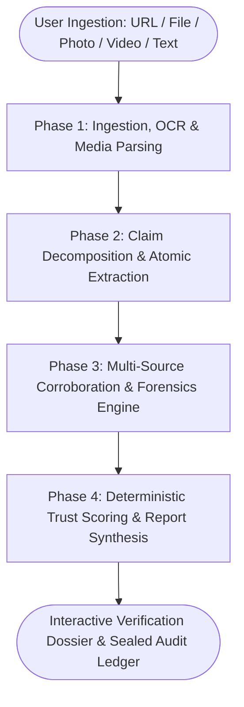

# 🛡️ ETRAI (Evidence-first Truth & Reliability AI)
### *DeepTrust Enterprise Fact-Checking, Multimodal Media Forensics & Audit Platform*

---

## 1. Executive Summary & Vision

**ETRAI (DeepTrust)** is an enterprise-grade, evidence-first automated verification and intelligence platform designed to debunk misinformation, detect sophisticated deepfakes and manipulated media, and provide reproducible, line-by-line auditable truth scores for news, claims, documents, photos, and video footage.

Unlike black-box AI checkers, ETRAI enforces **deterministic scoring**, **cryptographic provenance tracing**, and **strict evidentiary standards**: every claim must be backed by multi-source cross-corroboration, direct primary source lookup, or pixel/spectral-level forensic analysis.



---

## 2. Complete Technology Stack

| Layer | Technologies & Libraries | Key Responsibilities |
| :--- | :--- | :--- |
| **Frontend Framework** | **React 18**, **Vite 5**, **React Router v6** | Single-page application, client routing, responsive design |
| **Styling & Design System** | **Tailwind CSS**, **Vanilla CSS Variables**, **Lucide React** | Custom tokens (`--clay`, `--moss`, `--brick`, `--ochre`), glassmorphism, responsive data grids |
| **Real-time Streaming** | **Server-Sent Events (SSE)**, `EventSource` | Live agent log streaming, dynamic progress bar, interactive rail |
| **Backend Runtime** | **Node.js 20+**, **Express 4.19** | REST API, SSE endpoints, file streaming, rate limiting |
| **Database & ORM** | **PostgreSQL (Neon Cloud)**, **Prisma ORM 5.22** | Relational data persistence, tenant isolation, JSON report storage |
| **Primary AI Engine** | **Google Gemini (`@google/genai`)** (`gemini-flash-lite-latest` / `gemini-2.5-flash`) | Multimodal vision, claim extraction, semantic reasoning, search grounding |
| **Search & Discovery** | **Serper.dev Google Search API**, **Google Cloud Vision Web Detection** | Web cross-referencing, reverse image search, live news indexing |
| **Document Processing** | **`pdf-parse`**, **`mammoth` (DOCX)** | Document text layer extraction, circular header parsing |
| **Image & Signal Forensics** | **Custom Buffer Analyzers**, **Perceptual dHash/aHash**, **Quantization Table (DQT) Decoders**, **JPEG EOI / PNG IEND scanners** | EXIF extraction, C2PA validation, Error Level Analysis (ELA), copy-move detection |
| **Security & Safety** | **SSRF Guard** (`isSsrfSafeUrl`), **JWT (JSON Web Tokens)**, **bcryptjs**, **Helmet**, **express-rate-limit** | Protection against internal network scanning, secure cookies, brute-force defense |

---

## 3. Four-Phase Pipeline & The 9 Specialized Agents

When a verification job is initiated, it flows through four coordinated phases driven by **nine autonomous agents**:

```mermaid
graph LR
    subgraph "Phase 1: Ingestion & Extraction"
        A1[Agent 1: Ingestion & OCR]
        A2[Agent 2: Provenance & Origin]
        A3[Agent 3: Source Authority]
    end
    subgraph "Phase 2: Claim Extraction"
        A4[Agent 4: Atomic Claim Decomposition]
    end
    subgraph "Phase 3: Multi-Source Fact Matching"
        A5[Agent 5: Cross-Source Corroborator]
        A6[Agent 6: Document & Gazette Verifier]
        A7[Agent 7: Image Forensics Engine]
        A8[Agent 8: Video & Audio Analyzer]
    end
    subgraph "Phase 4: Synthesis & Reporting"
        A9[Agent 9: Entity & Intent Analyzer]
        Report[Report Generator & Trust Score Derivation]
    end
    A1 --> A2 --> A3 --> A4 --> A5 --> A6 --> A7 --> A8 --> A9 --> Report
```



### Phase 1: Ingestion, Extraction & Initial Observation
- **Agent 1: Ingestion & Structured OCR**
  - **Role**: Ingests raw inputs (URLs, PDF documents, DOCX files, raw JPG/PNG/WebP photos, MP4/MOV videos, or plain text).
  - **Tools**: Readability, multiline text normalizer, OCR v4, MediaProbe.
  - **Outputs**: Clean body prose, full OCR transcripts, embedded media buffers, metadata headers.
- **Agent 2: Provenance & First Appearance**
  - **Role**: Reconstructs the timeline and origin of the input asset.
  - **Tools**: Reverse index crawler, WHOIS lookup, SpreadGraph.
  - **Outputs**: First known timestamp, original publisher domain, repost count, amplification curve.
- **Agent 3: Source Authority & Reputation**
  - **Role**: Evaluates the publishing domain against custom ranked source tables (Rank 1 to Rank 4).
  - **Tools**: SourceRank, corrections history index, domain trust ledger.
  - **Outputs**: Source authority score (0–100), ranking tier, historical fabrication record.

### Phase 2: Claim Decomposition & Atomic Extraction
- **Agent 4: Claim Extraction & Normalization**
  - **Role**: Decomposes complex prose, speeches, or document text into standalone, atomic verifiable factual statements.
  - **Tools**: `ClaimSplit`, predicate analyzer, numerical fact isolate.
  - **Outputs**: List of atomic claims categorized by type (`QUANTITATIVE`, `DOCUMENTARY`, `ATTRIBUTED`, `FACTUAL`).

### Phase 3: Multi-Source Corroboration & Media Forensics
- **Agent 5: Cross-Source Fact Matcher**
  - **Role**: Queries live search indexes, Tier-1 news desks, official government gazettes, and prior debunk databases to evaluate each claim.
  - **Tools**: Serper search, Google Search grounding, FactBase.
  - **Outputs**: Stance per source (`SUPPORTS`, `CONTRADICTS`, `QUALIFIES`), citations, official denials.
- **Agent 6: Document & Gazette Verification**
  - **Role**: Validates official notices, gazettes, circulars, and memos.
  - **Tools**: Gazette reference index, seal raster diff, template overlap matcher.
  - **Outputs**: Reference number resolution, seal provenance, template fabrication score.
- **Agent 7: Image Forensics Engine**
  - **Role**: Performs deep visual forensic analysis and reverse image matching.
  - **Tools**: JPEG quantization (DQT) analysis, Error Level Analysis (ELA), C2PA manifest scanner, copy-move forgery detector, perceptual dHash.
  - **Outputs**: Manipulation likelihood ($0.00\text{--}1.00$), detected edit regions ($A, B, C, D\dots$), original wire archive image.
- **Agent 8: Video & Audio Forensics Engine**
  - **Role**: Analyzes video frames and audio tracks for generative deepfakes, face swaps, synthetic voices, and deceptive cuts.
  - **Tools**: Keyframe extractor, lip-sync deviation tracker, voice clone spectral analyzer, cut-point detector.
  - **Outputs**: Synthetic voice probability, face swap score, audio splice timestamps, transcript reconstruction of cut segments.

### Phase 4: Entity Profiling, Intent Analysis & Report Synthesis
- **Agent 9: Entity & Intent Analyzer**
  - **Role**: Discovers named entities (public figures, institutions, brands) and assesses the operational intent behind the content.
  - **Tools**: Public-figure index, quote veracity lookup, monetization/affiliate detector.
  - **Outputs**: Target audience profile, spread stage (`ACCELERATING`, `PLATEAU`), intent probabilities (e.g. *Panic Traffic Farming: 62%*, *Phishing Funnel: 21%*).

---

## 4. Media Forensics Subsystems

### A. Real "Image: Provided vs. Original" Comparison
- **Metadata Extraction**: Computes exact dimensions ($1600 \times 1000$), file size ($2.4\text{ MB}$), and real JPEG compression quality factor ($q78$) by analyzing DQT marker luminance tables.
- **C2PA / Content Credentials**: Checks for cryptographic JUMBF metadata containers and Adobe/Leica/Nikon hardware signatures.
- **Reverse Image Discovery**: Locates the earliest historical instance on Reuters, AP, AFP, or web archives. If novel, outputs `"None — no earlier instance anywhere"`.
- **Interactive Full-Page Split Slider**:
  - Drag-to-compare handle `⟺` with keyboard arrow support.
  - Superimposed bounding box markers ($A, B, C, D$) pointing to manipulated regions (e.g., banner replacement, inserted objects, cloned crowd).
  - CORS-safe proxy endpoint (`/api/v1/verify/proxy-image?url=...`) streaming original wire archive images securely.

### B. Video & Audio Deception Detection
- **Deceptive Cut Identification**: Detects mid-sentence audio cuts that omit critical context or denials.
- **Spectral Audio Waveform**: Generates time-series amplitude profiles highlighting splice points (e.g., cut at `0:18`).
- **Deepfake Signal Profiling**: Measures voice clone likelihood, lip-sync disparity, and re-encode generations.

### C. Document & Circular Forensics
- **Reference Number Validation**: Compares circular IDs against official indexes.
- **Seal & Template Diffing**: Detects lifted raster seals and recycled historical layout templates.

---

## 5. Deterministic Trust Score System

ETRAI uses a **reproducible, claim-weighted mathematical formula** to compute the overall Trust Score ($0\text{--}100$):

$$\text{Trust Score} = \max\left(0, \min\left(100, \sum_{i=1}^{n} (F_i \times W_i) - \text{Penalties}\right)\right)$$

### 1. Factor Weights Table (Configurable in Settings)

| Factor ($F_i$) | Default Weight ($W_i$) | Description |
| :--- | :---: | :--- |
| **Source Authority** | **22%** | Domain ranking tier (Rank 1–4) and historical accuracy |
| **Independent Corroboration** | **20%** | Number of tier-1 outlets independently carrying the claim |
| **Claim–Evidence Match** | **20%** | Degree to which cited evidence substantiates the assertion |
| **Media Integrity** | **15%** | Forensic absence of pixel edits, splices, or voice cloning |
| **Provenance Trail** | **10%** | Traceability back to an official primary origin |
| **Language & Framing** | **8%** | Absence of artificial urgency cues, clickbait, or forward-bait |
| **Amplification Pattern** | **5%** | Organic spread vs. coordinated bot reposting |

### 2. Flat Deductive Penalties
- **Fabricated Primary Document**: $-4.0\text{ to } -10.0\text{ pts}$
- **Pixel-Level Image Tampering**: $-2.6\text{ to } -6.0\text{ pts}$
- **Deceptive Audio/Video Splice**: $-1.2\text{ to } -3.0\text{ pts}$
- **Coordinated Bot Ingestion**: $-0.6\text{ to } -2.0\text{ pts}$

### 3. Verdict Tiers
- **TRUSTED / REAL**: Score $\ge 75$ (Emerald Green `#3E7A55`)
- **SUSPICIOUS / QUESTIONABLE**: Score $40\text{--}74$ (Ochre Amber `#B98520`)
- **FABRICATED / FAKE**: Score $< 40$ (Brick Red `#B23F35`)

---

## 6. Frontend Architecture & User Experience

```
frontend/src/
├── components/
│   ├── ImageForensicsCompare.jsx   # Interactive side-by-side comparison slider & asset cards
│   ├── Navbar.jsx                  # Navigation bar with live token usage and search hotkey (⌘K)
│   ├── ScoreDerivationSection.jsx  # Interactive factor breakdown bars and derivation summary
│   ├── GlobalSearchModal.jsx       # Universal search across reports, claims, and sources
│   ├── ReverifyModal.jsx           # Cryptographic re-verification confirmation modal
│   ├── VerdictBadge.jsx            # Status pill chips (Real, Suspicious, Fake, Unverified)
│   └── SseProgressRail.jsx         # 9-agent real-time execution animation rail
├── pages/
│   ├── DashboardPage.jsx           # High-level metrics, narrative cluster velocity, review queue
│   ├── NewAnalysisPage.jsx         # Live intake screen (URL, Video, Image, PDF, Text)
│   ├── ResultsPage.jsx             # Comprehensive 9-section Verification Dossier
│   ├── HistoryPage.jsx             # Cryptographically sealed ledger, CSV export & report deletion
│   ├── FakeNewsDeskPage.jsx        # Misinformation clusters and coordinated forward tracking
│   ├── SettingsPage.jsx            # Custom source rankings and scoring algorithm weight sliders
│   ├── AccountSecurityPage.jsx     # Workspace profile, 2FA, data retention & session management
│   ├── TeamPage.jsx                # Team member seats, role management (Owner, Creator, Reviewer, Reader)
│   └── SubscriptionPage.jsx        # Plan tiers (Starter, Team, Newsroom, Enterprise), usage & invoices
└── utils/
    ├── api.js                      # API base resolution (Localhost proxy vs. Railway production)
    └── featureFlags.js             # UI module feature toggles
```

---

## 7. Security, Tenant Isolation & SSRF Guard

1. **SSRF Guard (`ssrfGuard.js`)**:
   - Blocks private IP ranges (`10.0.0.0/8`, `172.16.0.0/12`, `192.168.0.0/16`, `127.0.0.1`, `0.0.0.0`).
   - Blocks AWS/GCP cloud metadata endpoints (`169.254.169.254`, `metadata.google.internal`).
   - Restricts protocols strictly to `http:` and `https:`.
2. **CORS-Safe Media Proxy (`/api/v1/verify/proxy-image`)**:
   - Safely streams third-party news photos and wire archive images to browser comparison canvases without exposing client IPs or triggering CORS violations.
3. **Workspace Tenant Isolation**:
   - All analyses, team members, custom source rankings, and API keys are scoped by `workspaceId` with role-based access control (`OWNER`, `CREATOR`, `REVIEWER`, `READER`).
4. **Cryptographic Sealing**:
   - Analyses are persisted with SHA-256 hashes. Re-verifying creates a versioned entry (`v2`, `v3`) while preserving immutable history.

---

## 8. Database Entity Schema (Prisma)

- **`User`**: Authentication credentials, workspace relationships, security logs.
- **`Workspace`**: Tenant workspace, subscription plan, seat limit, monthly verification allowance.
- **`Analysis`**: The core verification record storing input payload, trust score, verdict, summary, and structured JSON report.
- **`Claim`**: Individual atomic statements linked to an analysis with status, confidence, and stance.
- **`EvidenceItem`**: Source citations, quote matches, official denials, and factual rebuttals.
- **`MediaAnalysis`**: Video/image/audio forensic results, EXIF metadata, C2PA signatures, and OCR blocks.
- **`ProvenanceNode` & `SpreadCluster`**: Chronological diffusion graph across web domains and social networks.
- **`Subscription` & `Invoice`**: Billing cycles, seat allocations, and payment records.

---

## 9. Summary Table of Key Capabilities

| Capability | Supported Inputs / Features |
| :--- | :--- |
| **Input Modalities** | Web URLs, Video Links (YouTube, Instagram, TikTok), Image Uploads (JPG, PNG, WebP), PDFs, DOCX, Raw Text |
| **Forensic Inspections** | JPEG DQT Quantization, ELA, Copy-Move, C2PA Manifests, Lip-Sync Deviation, Synthetic Voice Cloning |
| **Source Intelligence** | Dynamic Domain Ranking (R1–R4), Automated Gazette Verification, FactBase Debunk Mapping |
| **User Interaction** | Real-Time SSE Log Streaming, Draggable Split Image Slider, Dynamic Algorithm Sliders, CSV Ledger Export |
| **Workflow Actions** | Sealed Report Re-verification, One-Click Report Deletion, Team Collaboration with Role Permissions |
