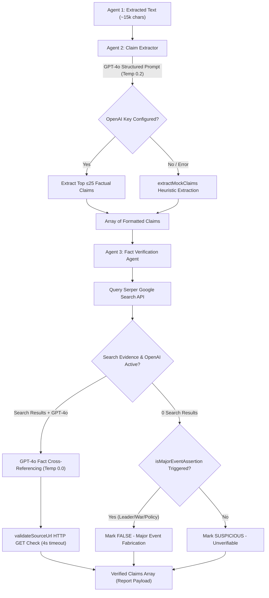

# ETRAI Architecture & Technical Documentation
## Agent 2 (Claim Extractor) & Agent 3 (Fact Verification Agent)

> [!NOTE]
> This document provides a complete technical specification of **Agent 2 (Claim Extractor)** and **Agent 3 (Fact Verification Agent)** within the **ETRAI AI Verification Engine**. It covers data flows, GPT-4o prompt strategies, live web search integration, fallback mechanisms, link validation, and deception detection algorithms.

---

## 1. Executive Summary & Pipeline Context

The **ETRAI** pipeline executes a sequential 4-agent workflow to audit documents, news content, and financial claims. While Agent 1 extracts raw text, **Agent 2** and **Agent 3** perform the core factual extraction and verification tasks:



---

## 2. Agent 2: Claim Extractor Service

* **Source File:** [`backend/src/services/claimExtractor.js`](file:///c:/Users/acer/.gemini/antigravity-ide/scratch/etrai/backend/src/services/claimExtractor.js)
* **Primary Role:** Converts raw document text into atomic, testable, quantitative factual assertions.

### 2.1 Input Guardrails
- Takes input from `contentRes.extractedText`.
- Truncates text to the first **15,000 characters** (`extractedText.substring(0, 15000)`) to ensure fast API response times and stay well within context token bounds.

### 2.2 Core GPT-4o Execution
Agent 2 calls OpenAI (`gpt-4o`, `temperature: 0.2`) with `response_format: { type: "json_object" }`.

#### System & Extraction Prompt:
```text
You are Agent 2 (Claim Extractor) in an AI Fact-Checking system.
Your task is to analyze the text below and extract up to 25 of the most important, specific, and verifiable factual claims.
Focus on:
1. Specific quantitative metrics, numbers, percentages, dates, and financial figures.
2. Direct factual assertions regarding events, companies, people, or scientific claims.
3. Statements that can be proven True or False by independent web search.

Return ONLY a valid JSON array of objects, where each object has:
- id: string (e.g. "claim_1")
- text: string (exact claim sentence, cleaned)
- category: string (e.g., "Statistical Metric", "Event Assertion", "Financial Claim", "Factual Statement")
- importanceScore: number (1-100)

STRICT RULE: Maximum 25 claims. Do not include opinions or subjective commentary.
```

### 2.3 Output Data Contract
Returns an array strictly capped at **25 claims**:
```json
[
  {
    "id": "claim_1",
    "text": "Global cloud computing expenditure grew by 24% in Q3 2024.",
    "category": "Statistical Metric",
    "importanceScore": 95
  },
  {
    "id": "claim_2",
    "text": "Company X acquired Startup Y for $1.2 billion in cash.",
    "category": "Financial Claim",
    "importanceScore": 88
  }
]
```

### 2.4 Algorithmic Heuristic Fallback (`extractMockClaims`)
If `OPENAI_API_KEY` is missing or fails:
1. Splits raw text into sentences via regex lookbehind: `/(?<=[.?!])\s+/`.
2. Filters sentences (length 20–250 chars) matching factual key terms:
   `/\d+|percent|dollar|company|market|report|announced|according|growth|year|million|billion|increase|decrease|found|proved|stated/i`.
3. Selects top 25 candidate sentences and calculates synthetic importance scores (`60` to `100`).

---

## 3. Agent 3: Fact Verification Agent Service

* **Source File:** [`backend/src/services/factVerifier.js`](file:///c:/Users/acer/.gemini/antigravity-ide/scratch/etrai/backend/src/services/factVerifier.js)
* **Primary Role:** Cross-references extracted claims against live search engines, validates source URLs, and assigns verification verdicts (`Verified`, `False`, `Suspicious`).

### 3.1 Live Web Search (`searchSerper`)
- Queries Google Serper API (`https://google.serper.dev/search`) for each claim query.
- Fetches top **5 organic search results** containing title, URL link, snippet, and clean domain hostname.
- Trusted domain filters prioritize recognized news agencies (`reuters.com`, `apnews.com`, `bbc.com`, `bloomberg.com`, `wsj.com`, `factcheck.org`, `snopes.com`, `.gov`, `.edu`).

### 3.2 Dual-Engine Verification & Classification Rubric
Retrieved search snippets are analyzed by `gpt-4o` (`temperature: 0.0`) using strict classification criteria:

| Verdict Status | Classification Rule | Default Confidence |
| :--- | :--- | :--- |
| **`Verified`** | Snippets **directly and explicitly corroborate** the claim. Must pass live HTTP URL validation. | 85% – 98% |
| **`False`** | Search snippets directly refute the claim **OR** the claim describes a major public event with zero search record. | 90% – 98% |
| **`Suspicious`** | Reserved for ambiguous assertions, minor uncorroborated statements, or links failing HTTP validation. | 50% – 70% |

### 3.3 Major Event Fabrication Detection (`isMajorEventAssertion`)

> [!WARNING]
> **Deception Safeguard:** When a document claims a major public leader action, war, military operation, or national emergency occurs, but **zero search coverage** exists, Agent 3 classifies the claim as **`False`** rather than ambiguous.

Regex pattern matching evaluates high-risk public claims:
```javascript
const majorPatterns = [
  /\bprime minister\b/i,
  /\bpresident\b/i,
  /\bmodi\b/i,
  /\bbiden\b/i,
  /\bputin\b/i,
  /\bxi jinping\b/i,
  /\bmilitary campaign\b/i,
  /\bdeclared war\b/i,
  /\binvaded\b/i,
  /\bmilitary operation\b/i,
  /\bcrossed border\b/i,
  /\bsigned treaty\b/i,
  /\bnuclear test\b/i,
  /\bstate of emergency\b/i
];
```

Standardized explanation attached upon detection:
> *"This claim describes an event of major significance with no corroborating coverage found across searched sources, which is strong evidence of fabrication."*

### 3.4 Live Source HTTP URL Validator (`validateSourceUrl`)
To prevent dead links (`404`) in reports:
- Sends an HTTP `GET` request to candidate URLs with an `AbortController` timeout of **4,000 ms**.
- Passes browser `User-Agent` headers to avoid false blocking.
- **Safety Downgrade:** If a claim was marked `Verified` but all supporting URLs fail HTTP validation, the verdict is automatically downgraded to `Suspicious` (or `False` if major event).

### 3.5 Output Data Contract
```json
[
  {
    "claimId": "claim_1",
    "claimText": "Global cloud computing expenditure grew by 24% in Q3 2024.",
    "category": "Statistical Metric",
    "status": "Verified",
    "confidence": 92,
    "explanation": "Confirmed by BBC News – Global Technology Report, which states that 'Official industry data confirms global cloud computing expenditure grew...'.",
    "sources": [
      {
        "title": "BBC News – Global Technology Report",
        "url": "https://www.bbc.com/news",
        "snippet": "Official industry data confirms global cloud computing expenditure grew...",
        "domain": "bbc.com"
      }
    ]
  }
]
```

---

## 4. Summary Comparison Matrix

| Operational Feature | Agent 2: Claim Extractor | Agent 3: Fact Verification Agent |
| :--- | :--- | :--- |
| **Primary Goal** | Isolate atomic, verifiable claims | Verify accuracy via live web search |
| **Input Payload** | Raw extracted document text | Extracted claim objects array |
| **AI Model & Temp** | `gpt-4o` (Temp: 0.2) | `gpt-4o` (Temp: 0.0) |
| **External APIs** | OpenAI API | OpenAI API + Serper Google Search API |
| **Processing Capping** | Max 25 Claims | Processes all claims from Agent 2 |
| **Link Integrity** | N/A | Live HTTP GET request (4s timeout) |
| **Fabrication Check** | Objective phrasing filter | `isMajorEventAssertion` regex engine |

---

*ETRAI Multi-Agent Fact Checking Platform Documentation*
