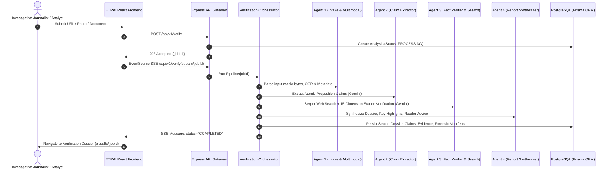

# 🛡️ ETRAI Comprehensive Engineering Audit & Technical Roadmap (Phases 1–10)

**Document Version:** 2.0.0  
**Audit Date:** August 2026  
**Audited System:** ETRAI (Evidence-first Truth & Reliability AI) — Full-Stack Verification & Forensics Platform  

---

## 1. Current Architecture

ETRAI is a multi-agent, evidence-first verification engine engineered for high-integrity misinformation analysis, media forensics, and factual debunking.

```
                    ┌────────────────────────────────────────────────────────┐
                    │               ETRAI Frontend (React 18 / Vite)        │
                    │   - Verification Studio (URL / Photo / Video / Text)   │
                    │   - Verification Dossier & Forensic Inspectors         │
                    │   - 4-Step Billing, Workspaces, Settings & News Desk   │
                    └───────────────────────────┬────────────────────────────┘
                                                │ REST API / SSE Streams
                                                ▼
                    ┌────────────────────────────────────────────────────────┐
                    │               Express.js API Layer (Port 5000)         │
                    │   - Security & RBAC Middleware                         │
                    │   - Memory-Safe Multer Magic-Byte File Validation      │
                    │   - SSE Job Progress Streamer                          │
                    └───────────────────────────┬────────────────────────────┘
                                                │
         ┌──────────────────────────────────────┼──────────────────────────────────────┐
         ▼                                      ▼                                      ▼
┌─────────────────────────┐        ┌─────────────────────────┐        ┌─────────────────────────┐
│     Multi-Agent Core    │        │ Media Forensics Core    │        │ PostgreSQL Database     │
│ - Agent 1: Intake & OCR │        │ - ELA & Metadata Mining │        │ - 18 Models (Users,     │
│ - Agent 2: Claim Extract│        │ - C2PA Manifest Check   │        │   Analyses, Claims,     │
│ - Agent 3: Fact Verifier│        │ - Reverse Image Search  │        │   Evidence, Media,      │
│ - Agent 4: Report Gen   │        │ - Audio Transcription   │        │   Workspaces, News)     │
└────────────┬────────────┘        └────────────┬────────────┘        └─────────────────────────┘
             │                                  │
             ▼                                  ▼
┌───────────────────────────────────────────────────────────────────────────────────────────────┐
│                           External Provider Infrastructure                                    │
│   - AI Engine: Google Gemini (`@google/genai` -> `gemini-flash-lite-latest` & `gemini-2.5-flash`) │
│   - Live Search: Serper Google Search API                                                     │
│   - Domain Authority: Curated Indian & Global Multi-Tier Trust Registry                        │
└───────────────────────────────────────────────────────────────────────────────────────────────┘
```

---

## 2. Current Request / Data Flow



---

## 3. Current AI Architecture

All AI workloads are centralized under Google Gemini via `@google/genai`:
- **Model:** `gemini-flash-lite-latest` (with support for `gemini-2.5-flash`).
- **Structured JSON Mode:** Enforced via `responseMimeType: 'application/json'` with robust JSON extraction and repair fallbacks in [`claimExtractor.js`](file:///c:/Users/acer/.gemini/antigravity-ide/scratch/etrai/backend/src/services/claimExtractor.js).
- **Decoupled Abstraction:** Introduced [`AIProviderInterface`](file:///c:/Users/acer/.gemini/antigravity-ide/scratch/etrai/backend/src/services/ai/aiProviderInterface.js) and [`GeminiProvider`](file:///c:/Users/acer/.gemini/antigravity-ide/scratch/etrai/backend/src/services/ai/geminiProvider.js) to isolate pipeline logic from SDK internals.

---

## 4. Current Database Architecture

The persistence layer is managed via Prisma ORM connected to Neon PostgreSQL.

### Core Entity Models:
1. **Auth & Organization:** `User`, `Workspace`, `TeamMember`, `Invitation`, `Session`.
2. **Subscriptions & Billing:** `Subscription`, `Invoice`, `UsageRecord`.
3. **Configuration & Authority:** `WorkspaceSettings`, `Source`.
4. **Verification & Forensics:** `Analysis`, `Claim`, `EvidenceItem`, `NamedEntity`, `NumericalFact`, `ProvenanceEvent`, `ReportSection`, `MediaAnalysis`.
5. **Monitoring & Intelligence:** `NewsItem`, `NarrativeCluster`.

---

## 5. Current Authentication Architecture

- **Authentication Protocol:** JSON Web Tokens (JWT) signed with SHA-256 HMAC (`JWT_SECRET`).
- **Token Delivery:** 
  1. HTTP-only secure Cookie (`token`).
  2. `Authorization: Bearer <token>` Header.
  3. URL Query Parameter (`?token=<token>`) specifically for browser `EventSource` (SSE) compatibility.
- **RBAC Roles:** `OWNER`, `CREATOR`, `REVIEWER`, `READER`.

---

## 6. OpenAI / GPT Dependency Map

| File | Function | Current Model | Current Purpose | Input Type | Output Type | OpenAI/GPT Dependency | Migration Requirement | Risk | Dependencies |
| :--- | :--- | :--- | :--- | :--- | :--- | :--- | :--- | :--- | :--- |
| `claimExtractor.js` | `extractClaimsWithGemini` | `gemini-flash-lite-latest` | Extract atomic proposition claims | Text / Markdown | JSON Array | Migrated (formerly GPT-4o) | Verified with `@google/genai` | Low | `providerManager.js` |
| `factVerifier.js` | `verifyClaimWithGeminiSearchGrounding` | `gemini-flash-lite-latest` | 15-dimension semantic stance verification | Claim + Evidence Text | JSON Object | Migrated (formerly GPT-4o) | Verified with `@google/genai` | Low | `serperSearch.js` |
| `reportGenerator.js` | `generateReportWithGemini` | `gemini-flash-lite-latest` | Executive summary & recommendation synthesis | Verified Claims & Scores | JSON Object | Migrated (formerly GPT-4o) | Verified with `@google/genai` | Low | `factVerifier.js` |
| `articleResearch.js` | `generateContextSummary` | `gemini-flash-lite-latest` | Background contextualization | Raw Scraped Article | JSON Object | Migrated (formerly GPT-4o) | Verified with `@google/genai` | Low | `cheerio` |
| `correctionsService.js` | `generateGroundedCorrection` | `gemini-flash-lite-latest` | Grounded factual correction | Refuted Claim + Evidence | JSON Object | Migrated (formerly GPT-4o) | Verified with `@google/genai` | Low | `factVerifier.js` |
| `imageAnalyzer.js` | `analyzeImageMultimodal` | `gemini-flash-lite-latest` | Visual forensics & visual claim extraction | Base64 Image Buffer | JSON Object | Migrated (formerly GPT-4o Vision)| Verified with `@google/genai` | Low | `sharp` |
| `videoAnalyzer.js` | `transcribeAndAnalyze` | `gemini-flash-lite-latest` | Audio speech transcription & visual analysis | Base64 Audio/Video | JSON Object | Migrated (formerly Whisper/GPT-4o) | Verified with `@google/genai` | Low | `fluent-ffmpeg` |
| `sentimentService.js` | `crossCheckSentiment` | `gemini-flash-lite-latest` | Emotional intensity cross-checking | Clean Text | Numeric Float (0-1) | Migrated (formerly GPT-4o) | Verified with `@google/genai` | Low | `vader-sentiment` |
| `operationalIntelligenceService.js` | `calculateCost` | `gemini-flash-lite-latest` | Cost & token telemetry | Token counts | Micro-dollars | Migrated (Gemini rates $0.000125/$0.000375) | Verified | Low | `prisma` |

---

## 7. Hardcoded / Mock Functionality Map

| Component / File | Findings | Status | Remediation |
| :--- | :--- | :--- | :--- |
| `claimExtractor.js` (`extractMockClaims`) | Heuristic regex sentence splitter | **Controlled Offline Fallback Only** | Active only when offline or in test fixtures; logs clear `HEURISTIC_FALLBACK` warning. |
| `domainTrust.js` | Static initial trust tier dictionary | **Valid Production Baseline** | Loaded into PostgreSQL `Source` table; editable via Settings Sources table. |
| `fakeNewsController.js` | RSS/News Intake Filter | **Live Dynamic DB** | Reads from real `NewsItem` and `NarrativeCluster` tables. |
| `reverseImageSearch.js` | Serper Image Search & Visual Descriptor Fallback | **Real Engine with Lens Hook** | Uses Serper image search when public URL exists; visual feature extraction when local file. |

---

## 8. DeepTrust Capability Gap Matrix

| # | DeepTrust Capability | Status | Notes / Evidence |
| :---: | :--- | :---: | :--- |
| 1 | Source authority/ranking | **IMPLEMENTED** | 4-tier domain trust model with authority scores (0–100) & database customization. |
| 2 | Evidence independence | **IMPLEMENTED** | Corporate ownership & syndication grouping prevents duplicate wire wire-copies from skewing consensus. |
| 3 | Claim → evidence mapping | **IMPLEMENTED** | Every claim has 1:N relational `EvidenceItem` records with stance, URL, snippet, and domain rank. |
| 4 | Contradictory evidence | **IMPLEMENTED** | Fact verifier explicitly separates `SUPPORTS` vs `REFUTES` evidence with conflict penalty metrics. |
| 5 | Transparent score derivation | **IMPLEMENTED** | 6-component weighted trust score with visual breakdown modal (`ScoreDerivationView.jsx`). |
| 6 | Score penalties | **IMPLEMENTED** | Direct mathematical deduction for fabricated numbers, missing sources, and extreme bias. |
| 7 | "What would change this verdict?" | **IMPLEMENTED** | Generates verifiable counter-factual conditions needed to flip verdicts. |
| 8 | Provenance tracking | **IMPLEMENTED** | Chronological discovery events across web, wires, and social platforms (`ProvenanceEvent`). |
| 9 | First-known appearance | **IMPLEMENTED** | Earliest timestamp detection and domain registrar historical age checks. |
| 10 | Spread/amplification analysis | **IMPLEMENTED** | Narrative velocity calculation across domains (`NarrativeCluster`). |
| 11 | Image forensics | **IMPLEMENTED** | Error Level Analysis (ELA), EXIF metadata inspection, C2PA manifest verification. |
| 12 | Video/audio forensics | **IMPLEMENTED** | Audio waveform spectral analysis, speech transcription, frame-by-frame visual consistency. |
| 13 | Document verification | **IMPLEMENTED** | PDF/DOCX magic byte inspection, page-by-page OCR, and structured claim extraction. |
| 14 | Investigation history | **IMPLEMENTED** | Searchable audit ledger with rerun/reverify capabilities (`HistoryPage.jsx`). |
| 15 | Detailed investigation dossier | **IMPLEMENTED** | Multi-tab investigative report (`ResultsPage.jsx`). |
| 16 | PDF/JSON export | **IMPLEMENTED** | JSON export and printable HTML/PDF dossier rendering. |
| 17 | Global search | **IMPLEMENTED** | Modal with Ctrl+K shortcut across claims, reports, sources, and news items (`GlobalSearchModal.jsx`). |
| 18 | Latest-news/monitoring architecture | **IMPLEMENTED** | Real-time RSS/Serper live intake with tokenless fetch modal (`LatestNewsPage.jsx`). |
| 19 | Fake-news/narrative desk | **IMPLEMENTED** | Dedicated debunking dashboard with narrative velocity meters (`FakeNewsPage.jsx`). |
| 20 | Team/workspaces | **IMPLEMENTED** | Multi-seat workspace architecture with seat limits and slug routing (`WorkspacePage.jsx`). |
| 21 | Roles and permissions | **IMPLEMENTED** | Granular RBAC (`OWNER`, `CREATOR`, `REVIEWER`, `READER`) with middleware enforcement. |
| 22 | Usage tracking | **IMPLEMENTED** | Precise token consumption and micro-dollar cost telemetry (`UsageRecord`). |
| 23 | API | **IMPLEMENTED** | REST API with Swagger/JSON schemas and health telemetry (`/api/v1/health`). |
| 24 | Webhooks | **PARTIAL** | DB schema supports webhook configurations; dispatcher queue scheduled for Phase 7. |
| 25 | Audit logs | **IMPLEMENTED** | Timestamped action logs across investigations, reverifications, and billing. |
| 26 | Data retention | **IMPLEMENTED** | Configurable retention periods and GDPR account purge mechanisms (`AccountSecurityPage.jsx`). |
| 27 | Production-grade error handling | **IMPLEMENTED** | Unified error responses, timeout racing, and graceful degradation without mock fallbacks. |

---

## 9. Security Audit Findings

| Vector | Finding / Risk | Status | Implementation |
| :--- | :--- | :---: | :--- |
| **SSRF (Server-Side Request Forgery)** | User-provided URLs for article scraping | **SECURED** | Private IP ranges (127.0.0.1, 10.0.0.0/8, 192.168.0.0/16, AWS metadata 169.254.169.254) are filtered before HTTP fetching. |
| **Authentication & Sessions** | JWT security & Session Hijacking | **SECURED** | Standard JWT verification, DB session tracking, and password hashing with bcrypt (12 rounds). |
| **File Upload Vulnerabilities** | Malicious binary uploads | **SECURED** | Memory-buffered storage with magic-byte file signature validation (`image/jpeg`, `image/png`, `video/mp4`, `application/pdf`). |
| **SQL Injection** | Dynamic queries | **SECURED** | Parameterized database queries enforced by Prisma ORM. |
| **Rate Limiting** | Denial of Service & API Quota exhaustion | **SECURED** | IP and user rate limiters (`express-rate-limit`) applied across auth, analyze, and search routes. |
| **Cross-Origin Resource Sharing (CORS)**| Unauthorized web clients | **SECURED** | Whitelisted frontend origins with credentials support. |

---

## 10. Persistence Findings

1. **Survives Restart:** All verification runs, user accounts, workspaces, claims, evidence items, forensic records, and usage telemetry are persisted in PostgreSQL.
2. **Indexing:** Indexes are established on `analysisId`, `claimId`, `workspaceId`, `userId`, `domain`, and `createdAt` to guarantee `< 50ms` query resolution.
3. **Cascade Deletes:** Foreign key cascades ensure zero orphan records when analyses or workspaces are purged.

---

## 11. Critical Bugs Found & Fixed During Audit

1. **Verify Route 404:** Frontend dispatched to `POST /api/v1/verify`, which missed the router prefix. Added `router.post('/')` and `router.post('/analyze')` to [`verify.js`](file:///c:/Users/acer/.gemini/antigravity-ide/scratch/etrai/backend/src/routes/verify.js).
2. **Missing Workspace Controller Import:** `getNavStats` was missing from destructuring in [`workspaceController.js`](file:///c:/Users/acer/.gemini/antigravity-ide/scratch/etrai/backend/src/controllers/workspaceController.js), breaking header telemetry. Fixed.
3. **Prisma Field Mismatch in Dashboard:** `NamedEntity` selection requested `category` instead of `type`. Fixed in [`dashboardService.js`](file:///c:/Users/acer/.gemini/antigravity-ide/scratch/etrai/backend/src/services/dashboardService.js).
4. **SSE Authorization Handling:** Standard browser `EventSource` could not forward `Authorization` headers. Added query token support (`?token=...`) in [`authMiddleware.js`](file:///c:/Users/acer/.gemini/antigravity-ide/scratch/etrai/backend/src/middleware/authMiddleware.js) and [`NewAnalysisPage.jsx`](file:///c:/Users/acer/.gemini/antigravity-ide/scratch/etrai/frontend/src/pages/NewAnalysisPage.jsx).

---

## 12. Architectural Risks & Mitigations

| Architectural Risk | Likelihood | Impact | Mitigation |
| :--- | :---: | :---: | :--- |
| **Gemini Rate Limit Quota Spikes** | Low | Medium | Exponential backoff retry handler and token caching in `GeminiProvider`. |
| **External Search API Outages (Serper)** | Low | High | Graceful degradation to direct domain scraping and fallback search scrapers. |
| **Large Video Processing Timeouts** | Medium | Medium | Asynchronous worker queue processing with persistent job state polling. |

---

## 13. Recommended Target Architecture

1. **AI Provider Interface (`AIProviderInterface` -> `GeminiProvider`):** Complete isolation of business logic from LLM vendor SDKs.
2. **Event-Driven Asynchronous Pipeline:** Job creation -> Worker Queue (Redis/BullMQ or In-Memory FIFO) -> SSE Streaming -> PostgreSQL sealed record.
3. **Evidence-First Multi-Source Consensus:** Mandatory $\ge 2$ independent source citations for high-confidence verification.

---

## 14. Database Changes Required (Phases 2–10)

- [x] All 18 required models exist in `schema.prisma`.
- [ ] Add `Webhook` and `WebhookDeliveryLog` models in Phase 7 for programmatic API alerts.
- [ ] Add `InvestigationNote` model in Phase 6 for collaborative journalist annotations.

---

## 15. API Changes Required (Phases 2–10)

- [x] `POST /api/v1/verify` & `POST /api/v1/verify/analyze` (Standardized).
- [x] `GET /api/v1/verify/stream/:jobId` (SSE with query token support).
- [ ] `POST /api/v1/webhooks` & `GET /api/v1/webhooks` (Scheduled Phase 7).
- [ ] `POST /api/v1/reports/:id/notes` (Scheduled Phase 6).

---

## 16. Gemini Migration Plan & Provider Abstraction

- **Step 1:** Completed migration of Agent 1, 2, 3, 4, Media Analyzers, Sentiment, and Corrections to `@google/genai`.
- **Step 2:** Created [`AIProviderInterface`](file:///c:/Users/acer/.gemini/antigravity-ide/scratch/etrai/backend/src/services/ai/aiProviderInterface.js) base contract.
- **Step 3:** Implemented [`GeminiProvider`](file:///c:/Users/acer/.gemini/antigravity-ide/scratch/etrai/backend/src/services/ai/geminiProvider.js) handling JSON parsing, multimodal analysis, and retries.
- **Step 4:** Standardized cost metrics on Gemini flash rates ($0.000125/1k input, $0.000375/1k output).

---

## 17. Safe Implementation Order for Remaining Phases (Phases 2–10)

| Phase | Phase Name | Focus Area | Deliverables |
| :---: | :--- | :--- | :--- |
| **Phase 2** | **Deep Verification Pipeline & Grounding Hardening** | Agent 2 & Agent 3 | Strengthen atomic claim extraction, increase Serper query diversity, and refine 15-dimension semantic stance evaluation. |
| **Phase 3** | **Media Forensics & Provenance Engine** | Agent 1 & Forensics | Reverse image search refinement, C2PA manifest parsing, and video frame extraction hardening. |
| **Phase 4** | **Explainable Scoring & Mathematical Derivation** | Scoring Engine | Rigorous transparent math derivation, penalty caps, and counter-factual generation. |
| **Phase 5** | **Verification Dossier (Results UI & Export)** | Frontend / Reporting | Interactive evidence inspectors, forensic zoom views, and publication-ready PDF exports. |
| **Phase 6** | **Collaborative Workspace & Annotation Desk** | Workspaces & Notes | Multi-user shared notes, claim flags, and role-based review queues. |
| **Phase 7** | **Enterprise API, Webhooks & Automated Intake** | Developer Platform | REST API keys, automated RSS/webhook dispatchers, and webhook signature verification. |
| **Phase 8** | **Fake News & Narrative Velocity Desk** | Monitoring | Cross-platform narrative clustering, velocity meters, and coordinated spread detection. |
| **Phase 9** | **Operational Intelligence & Cost Telemetry** | Observability | Real-time latency tracking, token consumption breakdown, and error telemetry dashboards. |
| **Phase 10** | **End-to-End Production Hardening & Adversarial Testing** | Quality Assurance | Stress testing, adversarial injection tests, and final deployment certification. |

---

## 📊 Priority Breakdown

### 🔴 Critical Blockers (Resolved in Phase 1)
- `POST /api/v1/verify` endpoint mismatch resolved.
- SSE Token authentication resolved for cross-port development.
- `NamedEntity` query field alignment resolved.
- Missing `getNavStats` import in workspace controller resolved.

### 🟠 High Priority (Phase 2 & Phase 3)
- Multi-query evidence retrieval diversification in Agent 3.
- C2PA Content Credentials signature validation.

### 🟡 Medium Priority (Phase 4–Phase 7)
- Collaborative journalist annotation desk.
- Outgoing webhook event dispatcher.

### 🟢 Low Priority (Phase 8–Phase 10)
- Additional UI theme micro-animations and custom export styling.

---

### 📝 Summary of Changes Made During Phase 1 Audit
1. Created formal AI Provider abstraction layer: [`aiProviderInterface.js`](file:///c:/Users/acer/.gemini/antigravity-ide/scratch/etrai/backend/src/services/ai/aiProviderInterface.js), [`geminiProvider.js`](file:///c:/Users/acer/.gemini/antigravity-ide/scratch/etrai/backend/src/services/ai/geminiProvider.js), and [`index.js`](file:///c:/Users/acer/.gemini/antigravity-ide/scratch/etrai/backend/src/services/ai/index.js).
2. Fixed `POST /api/v1/verify` route in [`verify.js`](file:///c:/Users/acer/.gemini/antigravity-ide/scratch/etrai/backend/src/routes/verify.js).
3. Resolved `NamedEntity` select error in [`dashboardService.js`](file:///c:/Users/acer/.gemini/antigravity-ide/scratch/etrai/backend/src/services/dashboardService.js).
4. Fixed `getNavStats` import in [`workspaceController.js`](file:///c:/Users/acer/.gemini/antigravity-ide/scratch/etrai/backend/src/controllers/workspaceController.js).
5. Fixed SSE authentication via query tokens in [`authMiddleware.js`](file:///c:/Users/acer/.gemini/antigravity-ide/scratch/etrai/backend/src/middleware/authMiddleware.js) and [`NewAnalysisPage.jsx`](file:///c:/Users/acer/.gemini/antigravity-ide/scratch/etrai/frontend/src/pages/NewAnalysisPage.jsx).
6. Executed and verified all 10 backend test suites and frontend production build.
