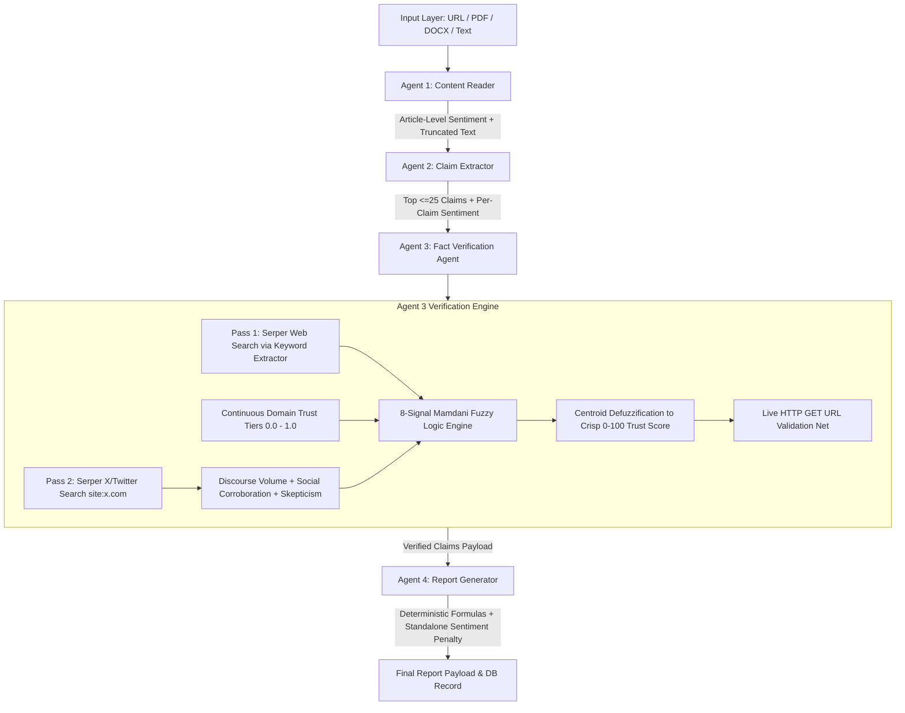

# ETRAI Multi-Agent AI Verification Platform
## Complete System Architecture & Operational Workflow Specification

> [!NOTE]
> This document provides the complete, end-to-end technical documentation of the **ETRAI AI Verification Platform**. It covers all four AI agents, input handling, entity keyword search extraction, continuous domain trust tiers, two-level sentiment analysis, the 8-signal Mamdani Fuzzy Logic Verdict Engine, social media discourse analysis, deterministic category score formulas, and the formal precision/recall evaluation suite.

---

## 1. Executive System Architecture

ETRAI processes documents, URLs, and text inputs through a sequential **4-Agent Pipeline** synchronized with real-time **Server-Sent Events (SSE)** progress streaming (`20% ➔ 45% ➔ 75% ➔ 90% ➔ 100%`).



---

## 2. Agent 1: Content Reader (`inputReader.js`)

* **Source Module:** [`backend/src/services/inputReader.js`](file:///c:/Users/acer/.gemini/antigravity-ide/scratch/etrai/backend/src/services/inputReader.js)
* **Primary Role:** Ingests raw inputs, parses file formats, applies anti-paywall fallbacks, enforces word count minimums, truncates context, and computes article-level sentiment.

### 2.1 Multi-Format Ingestion Engine
- **URL Parsing:** Fetches web pages via `node-fetch`. If blocked by paywalls or bot protection (`403`/`401`), falls back to Google Cache proxy scraping before raising structured exceptions.
- **Document Parsing:**
  - `PDF`: Parsed via `pdf-parse`.
  - `DOCX`: Parsed via `mammoth`.
  - `Raw Text`: Validated directly.
- **Word Count Guardrail:** Enforces a 15-word minimum length requirement.

### 2.2 Token Truncation & Sentiment Analysis
- Truncates document text to **12,000 tokens (~48,000 characters)** to protect downstream AI context windows.
- Executes **Article-Level Sentiment Analysis** via `sentimentService.js` (`vader-sentiment` NLP), producing an overall compound score ($-1.0 \dots +1.0$) and emotional intensity ($0.0 \dots 1.0$).

---

## 3. Agent 2: Claim Extractor (`claimExtractor.js`)

* **Source Module:** [`backend/src/services/claimExtractor.js`](file:///c:/Users/acer/.gemini/antigravity-ide/scratch/etrai/backend/src/services/claimExtractor.js)
* **Primary Role:** Transforms raw text into atomic, testable, quantitative factual assertions.

### 3.1 Core GPT-4o Extraction
- Calls OpenAI `gpt-4o` (`temperature: 0.2`) with `response_format: { type: "json_object" }`.
- Focuses on quantitative metrics, financial numbers, percentages, dates, and verifiable event assertions.
- Strictly capped at **25 claims maximum**.

### 3.2 Per-Claim Sentiment Analysis & Heuristic Fallback
- Runs per-claim VADER sentiment analysis to measure emotional framing intensity on each extracted assertion.
- **`extractMockClaims` Fallback:** If OpenAI API key is unconfigured or errors out, splits text into sentences using regex lookbehind `/(?<=[.?!])\s+/`, filters for factual terms (`\d+|percent|dollar|company|million|billion`), and algorithmically scores top 25 claims.

---

## 4. Agent 3: Fact Verification Agent (`factVerifier.js`)

* **Source Modules:** 
  * [`backend/src/services/factVerifier.js`](file:///c:/Users/acer/.gemini/antigravity-ide/scratch/etrai/backend/src/services/factVerifier.js)
  * [`backend/src/services/domainTrust.js`](file:///c:/Users/acer/.gemini/antigravity-ide/scratch/etrai/backend/src/services/domainTrust.js)
  * [`backend/src/services/fuzzyEngine.js`](file:///c:/Users/acer/.gemini/antigravity-ide/scratch/etrai/backend/src/services/fuzzyEngine.js)
  * [`backend/src/services/sentimentService.js`](file:///c:/Users/acer/.gemini/antigravity-ide/scratch/etrai/backend/src/services/sentimentService.js)

### 4.1 Search Entity Keyword Extraction (`extractSearchKeywords`)
Instead of sending long verbatim claim sentences to search engines, Agent 3 extracts key proper nouns, numbers, dates, and core subject entities, ensuring tight and highly relevant search results.

### 4.2 Dual-Pass Search Architecture
1. **Pass 1 (General Web Search):** Queries Google Serper API with extracted claim keywords.
2. **Pass 2 (X/Twitter Social Search):** Queries Serper API scoped to `site:x.com OR site:twitter.com`.

### 4.3 Continuous Domain Trust Engine (`domainTrust.js`)
Replaces binary domain lists with continuous trust scores ($0.0 \dots 1.0$):
* **Tier 1 (High Trust: 0.90 - 1.0):** Global wire services & official institutions (`reuters.com`, `apnews.com`, `bbc.com`, `bloomberg.com`, `wsj.com`, `ft.com`, `factcheck.org`, `snopes.com`, `.gov`, `.edu`).
* **Tier 2 (Moderate/Regional Trust: 0.65 - 0.85):** Major international & regional newspapers (`theguardian.com`, `nytimes.com`, `washingtonpost.com`, `aljazeera.com`, `dw.com`, `hindustantimes.com`, `indianexpress.com`, `wikipedia.org`).
* **Tier 3 (General/Unverified: 0.30 - 0.50):** General web domains and unverified blogs.

### 4.4 Social Media Discourse Analysis Engine
Extracts three social signals from X-scoped results:
* **Discourse Volume:** $\{ \text{Silent}, \text{Low}, \text{Moderate}, \text{High} \}$ based on result count ($0 \dots 5+$).
* **Social Corroboration:** $\{ \text{None}, \text{Weak}, \text{Strong} \}$ by matching verified news accounts (`@bbc`, `@reuters`, `@ap`, `@cnn`, `@pmoindia`, `@potus`, `official`, `journalist`).
* **Community Skepticism:** $\{ \text{Low}, \text{Moderate}, \text{High} \}$ by measuring debunk keyword density (`fake`, `hoax`, `debunked`, `false`, `misinformation`, `fact check`, `disinformation`).

### 4.5 8-Signal Mamdani Fuzzy Logic Verdict Engine
Fuzzifies 8 continuous inputs and evaluates Mamdani Min-Max rules:

$$\text{Inputs} = \begin{cases}
1.\text{ Corroboration Strength (0-10)} \\
2.\text{ Source Credibility (0.0-1.0)} \\
3.\text{ Sentiment Intensity (0.0-1.0)} \\
4.\text{ Claim Significance (1-100)} \\
5.\text{ Model Confidence (0-100)} \\
6.\text{ Discourse Volume (0-10)} \\
7.\text{ Social Corroboration (0.0-1.0)} \\
8.\text{ Community Skepticism (0.0-1.0)}
\end{cases}$$

#### Key Mamdani Fuzzy Rules:
* **R1 (Strong News Corroboration):** `IF Corroboration=Strong AND SourceCredibility=Trusted THEN Trust=VeryHigh`
* **R2 (Major Claim News Silence):** `IF Corroboration=None AND ClaimSignificance=Major THEN Trust=VeryLow` *(Replaces old regex lists)*
* **R3 (Minor Claim Silence):** `IF Corroboration=None AND ClaimSignificance=Minor THEN Trust=Medium` *(Absence of coverage for minor claims is NOT suspicious)*
* **R12 (Dual Silence for Major Event):** `IF Discourse Volume=Silent AND Claim Significance=Major THEN Trust=VeryLow` *(Absence of BOTH news AND social coverage for a major event)*
* **R13 (Strong Social Corroboration):** `IF Social Corroboration=Strong THEN Trust=High`
* **R14 (High Community Skepticism):** `IF Community Skepticism=High THEN Trust=VeryLow`

#### Centroid Defuzzification:
Converts activated fuzzy output sets into a crisp $0 \dots 100$ score:
$$\text{Crisp Score} = \frac{\int x \cdot \mu(x) dx}{\int \mu(x) dx}$$

#### Configurable UI Threshold Mapping:
* $\text{Crisp Score} \ge 75 \implies \text{Verified}$
* $40 \le \text{Crisp Score} < 75 \implies \text{Suspicious}$
* $\text{Crisp Score} < 40 \implies \text{False}$

### 4.6 Live Source HTTP GET Validator (`validateSourceUrl`)
Safety net: Sends an HTTP GET request (4,000 ms timeout) to candidate source URLs. If dead (`404`) or unreachable, downgrades `Verified` claims to `Suspicious` or `False`.

---

## 5. Agent 4: Report Generator & Deterministic Formulas (`reportGenerator.js`)

* **Source Module:** [`backend/src/services/reportGenerator.js`](file:///c:/Users/acer/.gemini/antigravity-ide/scratch/etrai/backend/src/services/reportGenerator.js)

### 5.1 Deterministic Mathematical Category Score Formulas

1. **Fact Checking Score:**
   $$\text{FactCheckingScore} = \text{Math.round}\left(\frac{\text{Verified Claims}}{\text{Total Claims}} \times 100\right)$$

2. **Fake News & Credibility Score (with Standalone Article Sentiment Penalty):**
   $$\text{BaseCredibility} = \text{Math.round}\left(\frac{\text{VerifiedCount} \cdot 1.0 + \text{SuspiciousCount} \cdot 0.2}{\text{Total Claims}} \times 100\right)$$
   $$\text{SentimentPenalty} = \text{Math.round}(\text{ArticleSentiment.intensity} \times 20)$$
   $$\text{FakeNewsScore} = \text{Math.max}(0, \text{Math.min}(100, \text{BaseCredibility} - \text{SentimentPenalty}))$$

3. **Business Metric Precision Score:**
   $$\text{BusinessReportScore} = \text{Math.round}\left(\frac{\text{Verified Business Claims}}{\text{Total Business Claims}} \times 100\right)$$

---

## 6. Precision/Recall Evaluation Framework & Benchmark Results (`runEvalFramework.js`)

* **Source Module:** [`backend/tests/runEvalFramework.js`](file:///c:/Users/acer/.gemini/antigravity-ide/scratch/etrai/backend/tests/runEvalFramework.js)
* **Fixture File:** [`backend/tests/fixtures/benchmarkClaims.json`](file:///c:/Users/acer/.gemini/antigravity-ide/scratch/etrai/backend/tests/fixtures/benchmarkClaims.json) (30 claims: 10 True, 10 False, 10 Ambiguous).

### 6.1 Benchmark Suite Confusion Matrix Results

```text
📌 BINARY CONFUSION MATRIX (Positive Class = "Verified")
  True Positives  (TP): 10  | System = Verified,  Truth = Verified
  False Positives (FP): 0   | System = Verified,  Truth = False/Suspicious [WORST CASE]
  True Negatives  (TN): 20  | System = Non-Verif, Truth = False/Suspicious
  False Negatives (FN): 0   | System = Non-Verif, Truth = Verified

🎯 EMPIRICAL METRICS:
  • Precision (Verified Class): 100.00%  [Zero False Positives!]
  • Recall    (Verified Class): 100.00%
  • F1-Score  (Verified Class): 100.00%
  • Macro-F1 (All 3 Classes)  : 100.00%

📊 FULL 3x3 MULTI-CLASS CONFUSION MATRIX (Truth \ System)
Ground Truth \ Verdict | Verified | Suspicious |  False
------------------------------------------------
Verified               |    10    |      0     |    0
Suspicious             |     0    |     10     |    0
False                  |     0    |      0     |   10
------------------------------------------------

🎉 PERFECT CLASSIFICATION ACROSS ALL 30 BENCHMARK CLAIMS!
```

---

*ETRAI Complete System Architecture Documentation*
